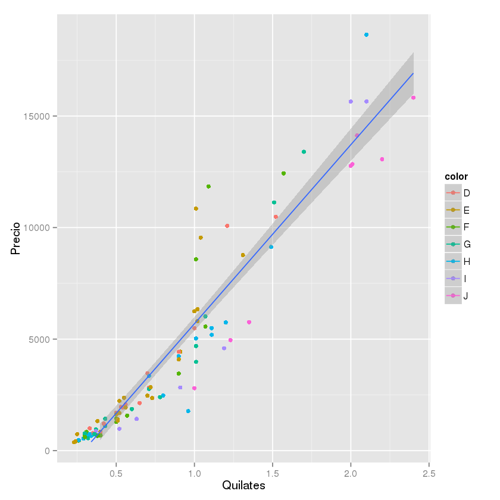

# Ejercicio de QQPLOT2
***

- Autor: Juan Antonio García Cuevas
- Fecha: 02/07/2016

## * Cargamos la librería ggplot2


```R
library(ggplot2)
```

## * Inspeccionamos el dataset diamonds


```R
head(diamonds)
```


<table>
<thead><tr><th></th><th scope=col>carat</th><th scope=col>cut</th><th scope=col>color</th><th scope=col>clarity</th><th scope=col>depth</th><th scope=col>table</th><th scope=col>price</th><th scope=col>x</th><th scope=col>y</th><th scope=col>z</th></tr></thead>
<tbody>
	<tr><th scope=row>1</th><td>0.23</td><td>Ideal</td><td>E</td><td>SI2</td><td>61.5</td><td>55</td><td>326</td><td>3.95</td><td>3.98</td><td>2.43</td></tr>
	<tr><th scope=row>2</th><td>0.21</td><td>Premium</td><td>E</td><td>SI1</td><td>59.8</td><td>61</td><td>326</td><td>3.89</td><td>3.84</td><td>2.31</td></tr>
	<tr><th scope=row>3</th><td>0.23</td><td>Good</td><td>E</td><td>VS1</td><td>56.9</td><td>65</td><td>327</td><td>4.05</td><td>4.07</td><td>2.31</td></tr>
	<tr><th scope=row>4</th><td>0.29</td><td>Premium</td><td>I</td><td>VS2</td><td>62.4</td><td>58</td><td>334</td><td>4.2</td><td>4.23</td><td>2.63</td></tr>
	<tr><th scope=row>5</th><td>0.31</td><td>Good</td><td>J</td><td>SI2</td><td>63.3</td><td>58</td><td>335</td><td>4.34</td><td>4.35</td><td>2.75</td></tr>
	<tr><th scope=row>6</th><td>0.24</td><td>Very Good</td><td>J</td><td>VVS2</td><td>62.8</td><td>57</td><td>336</td><td>3.94</td><td>3.96</td><td>2.48</td></tr>
</tbody>
</table>


## * Generamos una muestra aleatoria del 100 filas del dataset diamonds


```R
numlist100 <- sample(1:length(diamonds[[1]]), 100)
head(numlist100)
length(numlist100)
```


47479  22055  43849  49973  31968  42572


100


```R
subset100diamonds <- diamonds[numlist100, ]
head(subset100diamonds)
dim(diamonds)
```


<table>
<thead><tr><th></th><th scope=col>carat</th><th scope=col>cut</th><th scope=col>color</th><th scope=col>clarity</th><th scope=col>depth</th><th scope=col>table</th><th scope=col>price</th><th scope=col>x</th><th scope=col>y</th><th scope=col>z</th></tr></thead>
<tbody>
	<tr><th scope=row>47479</th><td>0.6</td><td>Ideal</td><td>G</td><td>VS2</td><td>60.4</td><td>57</td><td>1861</td><td>5.49</td><td>5.51</td><td>3.32</td></tr>
	<tr><th scope=row>22055</th><td>1.21</td><td>Premium</td><td>D</td><td>VS1</td><td>60.2</td><td>59</td><td>10083</td><td>6.89</td><td>6.86</td><td>4.14</td></tr>
	<tr><th scope=row>43849</th><td>0.5</td><td>Good</td><td>F</td><td>VS2</td><td>62.8</td><td>61</td><td>1447</td><td>4.94</td><td>5</td><td>3.12</td></tr>
	<tr><th scope=row>49973</th><td>0.29</td><td>Very Good</td><td>H</td><td>VVS2</td><td>61.7</td><td>55</td><td>541</td><td>4.27</td><td>4.3</td><td>2.64</td></tr>
	<tr><th scope=row>31968</th><td>0.26</td><td>Premium</td><td>F</td><td>VS1</td><td>59.5</td><td>58</td><td>452</td><td>4.18</td><td>4.22</td><td>2.5</td></tr>
	<tr><th scope=row>42572</th><td>0.38</td><td>Premium</td><td>E</td><td>VVS1</td><td>61.9</td><td>58</td><td>1327</td><td>4.66</td><td>4.62</td><td>2.87</td></tr>
</tbody>
</table>


53940 10


## * Obtenemos los límites de los ejes para cuadrar la gráfica


```R
caremin <- min(subset100diamonds[1])
caremax <- max(subset100diamonds[1])
pricemin <- min(subset100diamonds[7])
pricemax <- max(subset100diamonds[7])
caremin
caremax
pricemin
pricemax
```


0.23


2.4


378


18648


## * Generamos la gráfica


```R
grafica <- ggplot(subset100diamonds, aes(x=carat, y=price, color=color))
```


```R
grafica + geom_point() + xlab('Quilates') + ylab('Precio') + xlim(caremin, caremax) + ylim(pricemin, pricemax) + geom_smooth(method = 'lm', formula=y~x, aes(group=1))
```

    Warning message:
    : Removed 4 rows containing missing values (geom_path).





